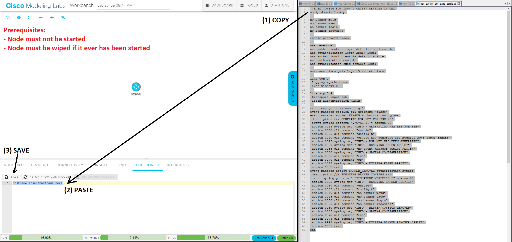

# IOSv & Cat8kv Base Config for CML
Base Configuration File for IOSv &amp; Cat8kv Devices for CML

## Introduction

This is a baseline/primer configuration for quickly provisioning Cisco IOSv and Cat8000v (Cat8kv)) devices in Cisco Modeling Labs (CML).

## Function

This configuration does the following:
- Sets `enable secret` password
- Sets `username/password`
- Configures `AAA`
- Generates `RSA key` for SSH
- Configures `VTY for SSH login`
- Disables `ip domain lookup`
- Disables ALL `banners` permanently
- Sets `logging synchronous` on console
- Disables `exec-timeout` on console

## Usage

## Notes

Modify as needed. Change passwords, timeouts, add interfaces, etc.